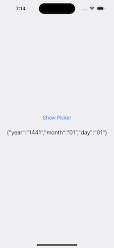
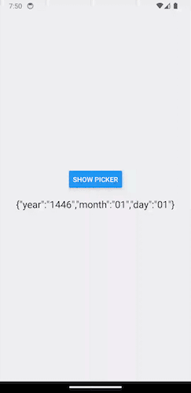

# Hijri Calendar Date Picker for React Native

## Installation

```sh
npm install react-native-hijri-date-picker
```

## Usage

```ts
import * as React from 'react';

import { StyleSheet, Text, View } from 'react-native';
import {
  HijriRNDatePicker,
  type TDate,
} from 'react-native-hijri-date-picker';

export default function App() {
  const [date, setDate] = React.useState<TDate>({
    year: '',
    month: '',
    day: '',
  });

  const updateDate = (params: TDate) => {
    setDate((prevDate) => ({
      ...prevDate,
      ...params,
    }));
  };

  return (
    <View style={styles.container}>
      <HijriRNDatePicker
        updateDate={updateDate}
        numericMonth={false}
        labelLang="en"
        valueLang="ar"
        viewStyle={{ width: 300 }}
      />
      <Text style={styles.label}>{JSON.stringify(date)}</Text>
    </View>
  );
}

const styles = StyleSheet.create({
  container: {
    flex: 1,
    alignItems: 'center',
    justifyContent: 'center',
    width: '100%',
    height: 500,
    backgroundColor: '#f0f0f0',
  },
  label: {
    fontSize: 20,
    marginTop: 20,
  },
});

```

## Screen Recording

### iOS + Android




## Contributing

See the [contributing guide](CONTRIBUTING.md) to learn how to contribute to the repository and the development workflow.

## License

MIT

---
